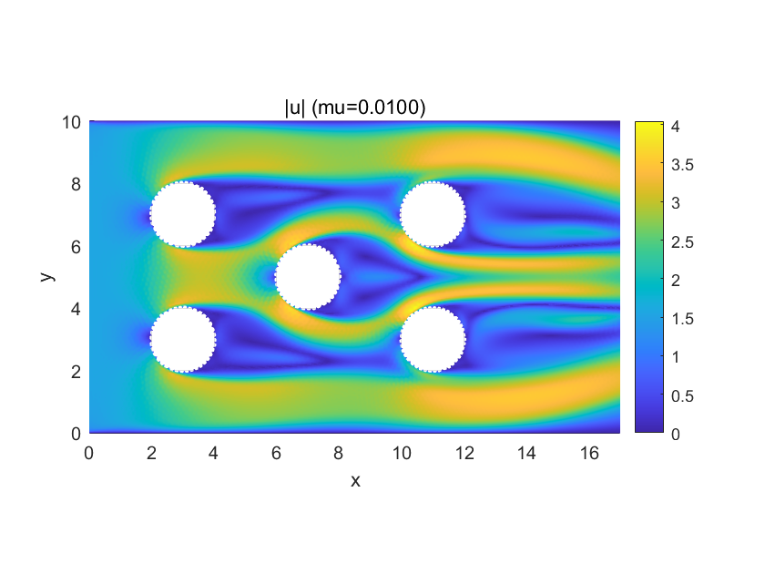
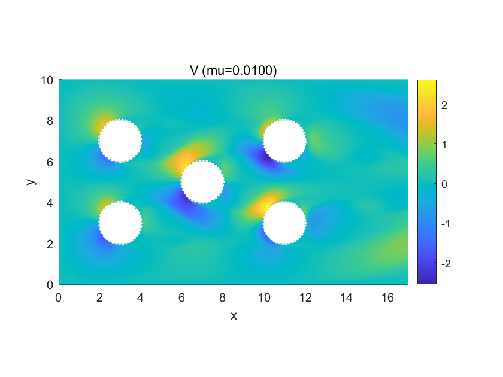
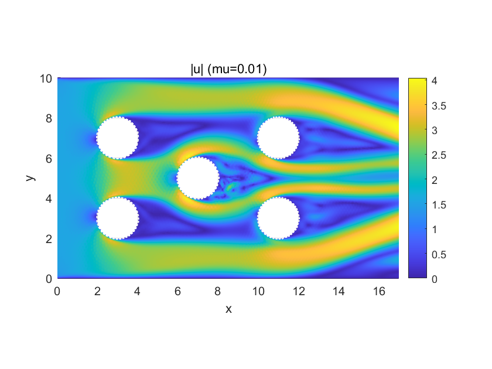
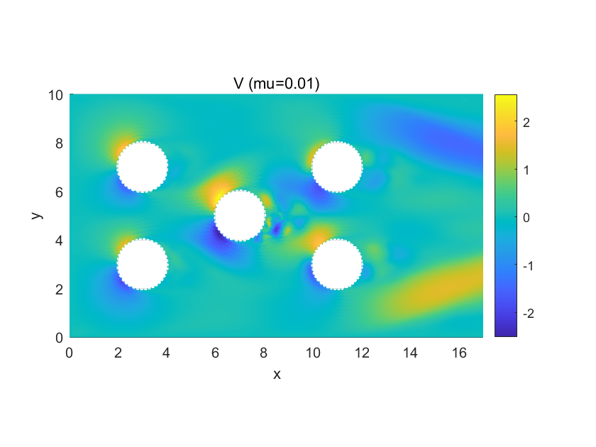
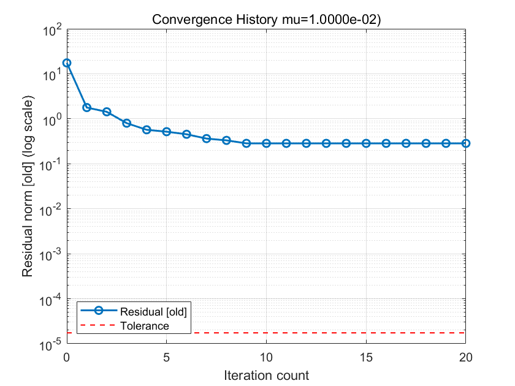
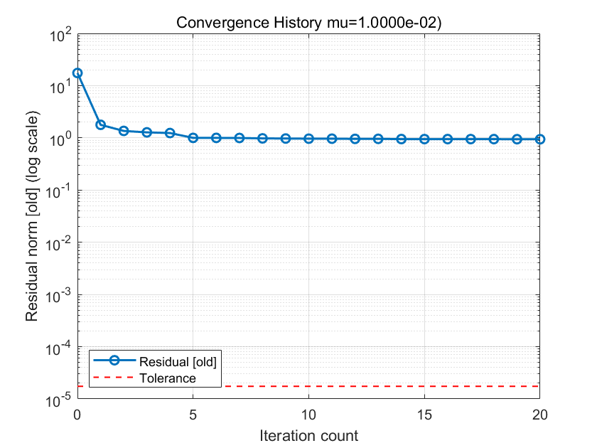

This repository contains the MATLAB project is focusing on solving steady-state and unsteady-state Navier-Stokes equations for 2D channel flow. The project implements and compares various advanced numerical methods to simulate complex incompressible fluid flow around multiple cylindrical obstacles.


*The von Kármán vortex street phenomenon, successfully captured in the unsteady simulation at a low viscosity (μ=0.01).*

## Project Overview

This project aims to numerically solve the classic computational fluid dynamics problem of 2D flow in a channel with multiple obstacles using the Finite Element Method (FEM). We begin by generating a high-quality unstructured mesh using the `Distmesh` toolbox and employ Taylor-Hood (P2-P1) elements for spatial discretization to ensure the stability and accuracy of the numerical solution.

The core of the project lies in the implementation and comparison of several iterative strategies for handling the non-linear term in the Navier-Stokes equations, including **Stokes (Picard) Linearization**, **Oseen Linearization**, and **Approximate Newton Linearization**. To enhance algorithmic robustness, we introduce a **backtracking line search with the Armijo condition** as a globalization strategy. Finally, the project is extended to unsteady problems, where a **full Newton system** is solved at each time step, successfully simulating the complete evolution from an initial state to a periodic vortex street.

## Governing Equations and Discretization

### 1. Steady-State Navier-Stokes Equations

#### a) Governing Equations (Strong Form)
The steady-state problem describes the final equilibrium state of the fluid flow. The velocity field **u** and pressure field *p* satisfy the following system of equations:
```math
\begin{aligned}
-\mu \Delta \mathbf{u} + (\mathbf{u} \cdot \nabla)\mathbf{u} + \nabla p &= \mathbf{f} \\
\nabla \cdot \mathbf{u} &= 0 
\end{aligned}
```
#### b) Spatial Discretization (Finite Element Weak Form)

By multiplying by test functions **v** and *q* and integrating over the domain Ω, we convert the strong form into a weak form:
```math
\begin{aligned}
(\mu \nabla \mathbf{u}, \nabla \mathbf{v}) + ((\mathbf{u} \cdot \nabla)\mathbf{u}, \mathbf{v}) - (p, \nabla \cdot \mathbf{v}) &= (\mathbf{f}, \mathbf{v}) \quad \forall \mathbf{v} \in V^0 \\
(\nabla \cdot \mathbf{u}, q) &= 0 \quad \forall q \in Q
\end{aligned}
```
where `(a, b)` denotes the L2 inner product `∫_Ω a·b dΩ`. After discretizing with Taylor-Hood (P2-P1) elements, we obtain a large-scale non-linear algebraic system:
```math
\begin{pmatrix}
\mu K + N(U) & B^T \\
B & 0
\end{pmatrix}
\begin{pmatrix}
U \\
P
\end{pmatrix}
=
\begin{pmatrix}
F \\
0
\end{pmatrix}
```
- **K**: Stiffness matrix (from the diffusion term `μΔu`)
- **N(U)**: Non-linear convection matrix (from the convection term `(u·∇)u`)
- **B**: Divergence matrix
- **U, P**: Unknown coefficient vectors for velocity and pressure

### 2. Unsteady Navier-Stokes Equations

#### a) Governing Equations (Strong Form)
The unsteady problem describes the evolution of the flow field over time `t`. The governing equations include a time derivative term:

```math
\begin{aligned}
\frac{\partial \mathbf{u}}{\partial t} - \mu \Delta \mathbf{u} + (\mathbf{u} \cdot \nabla)\mathbf{u} + \nabla p &= \mathbf{f} \\
\nabla \cdot \mathbf{u} &= 0
\end{aligned}
```

#### b) Temporal and Spatial Discretization
We employ a "Method of Lines" approach:
1.  **Temporal Discretization (Implicit Euler Method)**: We discretize the time derivative using the first-order accurate Implicit Euler scheme to solve for `u^n` at time step `n`:
    ```math
    \frac{\mathbf{u}^n - \mathbf{u}^{n-1}}{\Delta t} - \mu \Delta \mathbf{u}^n + (\mathbf{u}^n \cdot \nabla)\mathbf{u}^n + \nabla p^n = \mathbf{f}^n
    ```
    Rearranging this yields a steady-state-like non-linear equation to be solved at each time step.

2.  **Spatial Discretization (Finite Element Weak Form)**: Applying the same FEM procedure as in the steady case to the time-discretized equation, we get the algebraic system for each time step `n`:

    ```math
    \begin{pmatrix}
    \frac{1}{\Delta t}M + \mu K + N(U^n) & B^T \\
    B & 0
    \end{pmatrix}
    \begin{pmatrix}
    U^n \\
    P^n
    \end{pmatrix}
    =
    \begin{pmatrix}
    \frac{1}{\Delta t}M U^{n-1} + F^n \\
    0
    \end{pmatrix}
    ```
    
    - **M**: Mass matrix (from the time derivative term `∂u/∂t`)
    - **U^(n-1)**: The known velocity solution from the previous time step

## Numerical Implementation Details

### 1. Mesh Generation
We use `Distmesh` to generate a quasi-uniform triangular mesh, which is then elevated to P2 quadratic elements for the Taylor-Hood formulation.


### 2. Finite Element Assembly Core
The core of our solver involves assembling matrices by integrating products of basis functions and their derivatives over each element.

#### a) Basis Functions (`basis_function.m`)
This crucial utility function computes the values and derivatives of the P2 Lagrange basis functions on a reference triangular element. These values are pre-calculated at the Gauss quadrature points and are the fundamental building blocks for assembling all system matrices.

```matlab
function phi=basis_function(p,ndx,ndy,gauss)
  n=(p+2)*(p+1)/2;m=size(gauss,1);
  phi=zeros(n,m);
  %P1element
  if p==1
   for j=1:m
    x=gauss(j,1);y=gauss(j,2);
    if ndx==0&&ndy==0 %basisfunctions
      phi(1,j)=-x-y+1; %point1:(0,0)
      phi(2,j)=x; %point2:(1,0)
      phi(3,j)=y; %point3:(0,1)
    end
    if ndx==1&&ndy==0 %firstderivativeforx
      phi(1,j)=-1;phi(2,j)=1;phi(3,j)=0;
    end
    if ndx==0&&ndy==1 %firstderivativefory
      phi(1,j)=-1;phi(2,j)=0;phi(3,j)=1;
    end
   end
  end
  %P2element
  if p==2
    for j=1:m
      x=gauss(j,1);y=gauss(j,2);
      if ndx==0 && ndy==0%basisfunctions
        phi(1,j)=2*x^2+2*y^2+4*x*y-3*y-3*x+1;%point1:(0,0)
        phi(2,j)=2*x^2-x;%point2:(1,0)
        phi(3,j)=2*y^2-y;%point3:(0,1)
        phi(4,j)=-4*x^2-4*x*y+4*x;%point4:(1/2,0)
        phi(5,j)=4*x*y;%point5:(1/2,1/2)
        phi(6,j)=-4*y^2-4*x*y+4*y;%point6:(0,1/2)
      end
      if ndx==1&&ndy==0%firstderivativeforx
        phi(1,j)=4*x+4*y-3;phi(2,j)=4*x-1;phi(3,j)=0;
        phi(4,j)=-8*x-4*y+4;phi(5,j)=4*y;phi(6,j)=-4*y;
      end
      if ndx==0&&ndy==1%firstderivativefory
        phi(1,j)=4*y+4*x-3;phi(2,j)=0;phi(3,j)=4*y-1;
        phi(4,j)=-4*x;phi(5,j)=4*x;phi(6,j)=-8*y-4*x+4;
      end
    end
  end
end
```

#### b) Oseen Convection Matrix (`assemble_An1_v`)
This function assembles the matrix for the Oseen term `C(u_k-1; u, v) = ∫_Ω ((u_k-1 · ∇)u) · v dΩ`. The resulting matrix `An1` has entries `(An1)_ij = ∫_Ω ((u_k-1 · ∇)φ_j) φ_i dΩ`.

**Code Snippet: `assemble_An1_v.m`**
```matlab
function An1 = assemble_An1_v(P,T,Pb, Tb, gauss_bary, weight, p_fem, u_k_vec)
    Npb = size(Pb, 1);
    Ne = size(Tb, 1);
    Nlb = size(Tb, 2);
    Ng = size(gauss_bary, 1);

    % --- Input Checks and Preparation ---
    if size(gauss_bary, 2) ~= 3
        error('assemble_An1_v requires barycentric coordinates (Ng x 3)');
    end
    if size(weight, 1) ~= 1 || size(weight, 2) ~= Ng
         if size(weight, 2) == 1 && size(weight, 1) == Ng
             weight = weight'; % Ensure it's a row vector
         else
            error('Weight vector dimension should be 1 x Ng');
         end
    end
    if isvector(u_k_vec) && length(u_k_vec) == 2 * Npb
        u_k = [u_k_vec(1:Npb), u_k_vec(Npb+1:2*Npb)];
    elseif size(u_k_vec, 1) == Npb && size(u_k_vec, 2) == 2
        u_k = u_k_vec;
    else
        error('Input velocity field u_k_vec has incorrect format');
    end

    % --- Coordinate Transformation: Barycentric -> Reference Cartesian ---
    gauss_xy = gauss_bary(:,); % x = lambda2, y = lambda3

    % --- Get Basis Function Values and Derivatives ---
    phi_ref = basis_function(p_fem, 0, 0, gauss_xy); % Values @ Ng points, Nlb x Ng
    dphix_ref = basis_function(p_fem, 1, 0, gauss_xy); % Ref x-derivatives, Nlb x Ng
    dphiy_ref = basis_function(p_fem, 0, 1, gauss_xy); % Ref y-derivatives, Nlb x Ng

    % --- Sparse Matrix Assembly Preparation (Pre-allocation) ---
    max_entries = Ne * Nlb * Nlb;
    ii = zeros(max_entries, 1);
    jj = zeros(max_entries, 1);
    ss = zeros(max_entries, 1);
    entry_count = 0;

    % --- Loop over Elements for Assembly ---
    for k = 1:Ne
        nodes_k = Tb(k, :);
        P_k_vertices = P(T(k,:), :);

        x1=P_k_vertices(1,1); y1=P_k_vertices(1,2);
        x2=P_k_vertices(2,1); y2=P_k_vertices(2,2);
        x3=P_k_vertices(3,1); y3=P_k_vertices(3,2);
        detJ = (x2-x1)*(y3-y1) - (x3-x1)*(y2-y1);

        if abs(detJ) < 1e-12; continue; end
        abs_detJ = abs(detJ);

        invJ11 =  (y3-y1)/detJ; invJ12 = -(x3-x1)/detJ;
        invJ21 = -(y2-y1)/detJ; invJ22 =  (x2-x1)/detJ;

        u_k_local_nodes = u_k(nodes_k, :);
        u_k_at_gauss = u_k_local_nodes' * phi_ref;

        dphix_phys = invJ11 * dphix_ref + invJ21 * dphiy_ref;
        dphiy_phys = invJ12 * dphix_ref + invJ22 * dphiy_ref;

        Ck_local = zeros(Nlb, Nlb);
        for i = 1:Nlb
            for j = 1:Nlb
                uk_dot_grad_phij = u_k_at_gauss(1,:) .* dphix_phys(j,:) ...
                                 + u_k_at_gauss(2,:) .* dphiy_phys(j,:);
                integrand = uk_dot_grad_phij .* phi_ref(i,:);
                Ck_local(i,j) = (integrand .* weight) * ones(Ng, 1) * abs_detJ;
            end
        end

        row_indices_global = repmat(nodes_k', Nlb, 1);
        col_indices_global = repelem(nodes_k', Nlb, 1);
        num_local_entries = Nlb * Nlb;
        current_range = entry_count + (1:num_local_entries);

        ii(current_range) = row_indices_global;
        jj(current_range) = col_indices_global;
        ss(current_range) = Ck_local(:);
        entry_count = entry_count + num_local_entries;
    end

    % --- Assemble Global Sparse Matrix C ---
    ii = ii(1:entry_count);
    jj = jj(1:entry_count);
    ss = ss(1:entry_count);
    C = sparse(ii, jj, ss, Npb, Npb);

    % --- Construct Final Block Diagonal Matrix An1 ---
    An1 = blkdiag(C, C);
end
```

#### c) Newton Convection Jacobian (`assemble_An2_v`)
This function assembles the other part of the convection Jacobian, `∫_Ω ((δu · ∇)u_k-1) · v dΩ`. For `δu = φ_j` and `v = φ_i`, this term couples the velocity components, resulting in a 2x2 block matrix `An2`.

**Code Snippet: `assemble_An2_v.m`**
```matlab
function An2 = assemble_An2_v(P, T, Pb, Tb, gauss_bary, weight, p_fem, u_k_vec)
    Npb = size(Pb, 1);
    Ne = size(Tb, 1);
    Nlb = size(Tb, 2);
    Ng = size(gauss_bary, 1);

    % --- Input Checks and Preparation ---
    if isvector(u_k_vec) && length(u_k_vec) == 2 * Npb; u_k = [u_k_vec(1:Npb), u_k_vec(Npb+1:2*Npb)];
    elseif size(u_k_vec, 1) == Npb && size(u_k_vec, 2) == 2; u_k = u_k_vec;
    else; error('Input velocity field u_k_vec has incorrect format'); end
    
    gauss_xy = gauss_bary(:,);
    phi_ref = basis_function(p_fem, 0, 0, gauss_xy);
    dphix_ref = basis_function(p_fem, 1, 0, gauss_xy);
    dphiy_ref = basis_function(p_fem, 0, 1, gauss_xy);

    % --- Sparse Matrix Assembly Preparation ---
    max_entries_total = 4 * Ne * Nlb * Nlb;
    ii_An2 = zeros(max_entries_total, 1); jj_An2 = zeros(max_entries_total, 1); ss_An2 = zeros(max_entries_total, 1);
    entry_count_total = 0;

    % --- Loop over Elements ---
    for k = 1:Ne
        nodes_k = Tb(k, :);
        P_k_vertices = P(T(k,:), :);
        x1=P_k_vertices(1,1); y1=P_k_vertices(1,2); x2=P_k_vertices(2,1); y2=P_k_vertices(2,2); x3=P_k_vertices(3,1); y3=P_k_vertices(3,2);
        detJ = (x2-x1)*(y3-y1) - (x3-x1)*(y2-y1);
        if abs(detJ) < 1e-12; continue; end
        abs_detJ = abs(detJ);
        invJ11=(y3-y1)/detJ; invJ12=-(x3-x1)/detJ; invJ21=-(y2-y1)/detJ; invJ22=(x2-x1)/detJ;

        u_k_local_nodes = u_k(nodes_k, :);
        dphix_phys = invJ11 * dphix_ref + invJ21 * dphiy_ref;
        dphiy_phys = invJ12 * dphix_ref + invJ22 * dphiy_ref;

        duk1_dx_at_gauss = u_k_local_nodes(:, 1)' * dphix_phys;
        duk1_dy_at_gauss = u_k_local_nodes(:, 1)' * dphiy_phys;
        duk2_dx_at_gauss = u_k_local_nodes(:, 2)' * dphix_phys;
        duk2_dy_at_gauss = u_k_local_nodes(:, 2)' * dphiy_phys;

        % --- Vectorized computation of local matrix blocks ---
        phi_outer_phi_times_weight_detJ = zeros(Nlb, Nlb, Ng);
        for q=1:Ng
            phi_q = phi_ref(:, q);
            phi_outer_phi_times_weight_detJ(:,:,q) = (phi_q * phi_q') * weight(q) * abs_detJ;
        end

        Ck_11 = sum(phi_outer_phi_times_weight_detJ .* reshape(duk1_dx_at_gauss, 1, 1, Ng), 3);
        Ck_12 = sum(phi_outer_phi_times_weight_detJ .* reshape(duk1_dy_at_gauss, 1, 1, Ng), 3);
        Ck_21 = sum(phi_outer_phi_times_weight_detJ .* reshape(duk2_dx_at_gauss, 1, 1, Ng), 3);
        Ck_22 = sum(phi_outer_phi_times_weight_detJ .* reshape(duk2_dy_at_gauss, 1, 1, Ng), 3);

        % --- Store triplets for sparse assembly ---
        for i = 1:Nlb; for j = 1:Nlb
                global_row_i = nodes_k(i); global_col_j = nodes_k(j);
                if abs(Ck_11(i,j)) > 1e-14; entry_count_total = entry_count_total + 1; ii_An2(entry_count_total) = global_row_i;      jj_An2(entry_count_total) = global_col_j;      ss_An2(entry_count_total) = Ck_11(i,j); end
                if abs(Ck_12(i,j)) > 1e-14; entry_count_total = entry_count_total + 1; ii_An2(entry_count_total) = global_row_i;      jj_An2(entry_count_total) = global_col_j + Npb; ss_An2(entry_count_total) = Ck_12(i,j); end
                if abs(Ck_21(i,j)) > 1e-14; entry_count_total = entry_count_total + 1; ii_An2(entry_count_total) = global_row_i + Npb; jj_An2(entry_count_total) = global_col_j;      ss_An2(entry_count_total) = Ck_21(i,j); end
                if abs(Ck_22(i,j)) > 1e-14; entry_count_total = entry_count_total + 1; ii_An2(entry_count_total) = global_row_i + Npb; jj_An2(entry_count_total) = global_col_j + Npb; ss_An2(entry_count_total) = Ck_22(i,j); end
        end; end
    end

    % --- Assemble Global Sparse Matrix An2 ---
    if entry_count_total > 0
        ii_An2 = ii_An2(1:entry_count_total); jj_An2 = jj_An2(1:entry_count_total); ss_An2 = ss_An2(1:entry_count_total);
        An2 = sparse(ii_An2, jj_An2, ss_An2, 2*Npb, 2*Npb);
    else
        An2 = sparse(2*Npb, 2*Npb);
    end
end
```

## Simulation Results and Analysis

### I. Steady-State Simulations
In steady-state simulations, we solve for the final equilibrium state of the flow field.

#### Oseen Linearization Results
| Velocity Magnitude `|u|` (μ=0.01) | V-Component of Velocity `V` (μ=0.01) |
| :---: | :---: |
|  |  |

#### Newton Linearization Results
| Velocity Magnitude `|u|` (μ=0.01) | Streamlines (μ=0.01) |
| :---: | :---: |
|  |  |

#### Convergence Comparison (μ=0.01)
| Oseen Convergence History | Newton Convergence History |
| :---: | :---: |
|  |  |

---

### II. Unsteady-State Simulations
For a low viscosity of `μ=0.01`, we successfully captured the classic **von Kármán vortex street**.

#### Formation and Development of the Vortex Street
The flow begins from a quasi-steady state, gradually becomes unstable, and vortices begin to shed alternately from the obstacles, forming a periodic wake.

**t = 1.0 (Initial Development)**
| Velocity Magnitude `|u|` | Streamlines |
| :---: | :---: |
|  |  |

**t = 5.0 (Vortex Amplification)**
| Velocity Magnitude `|u|` | Streamlines |
| :---: | :---: |
|  |  |

**t = 11.4 (Periodic Vortex Street)**
| Velocity Magnitude `|u|` | Streamlines |
| :---: | :---: |
|  |  |

## Further information

I might neglect some functions in this projectm since this was accomplished 6 month ago. If you find something missing, please contact me. Thnaks.
```
